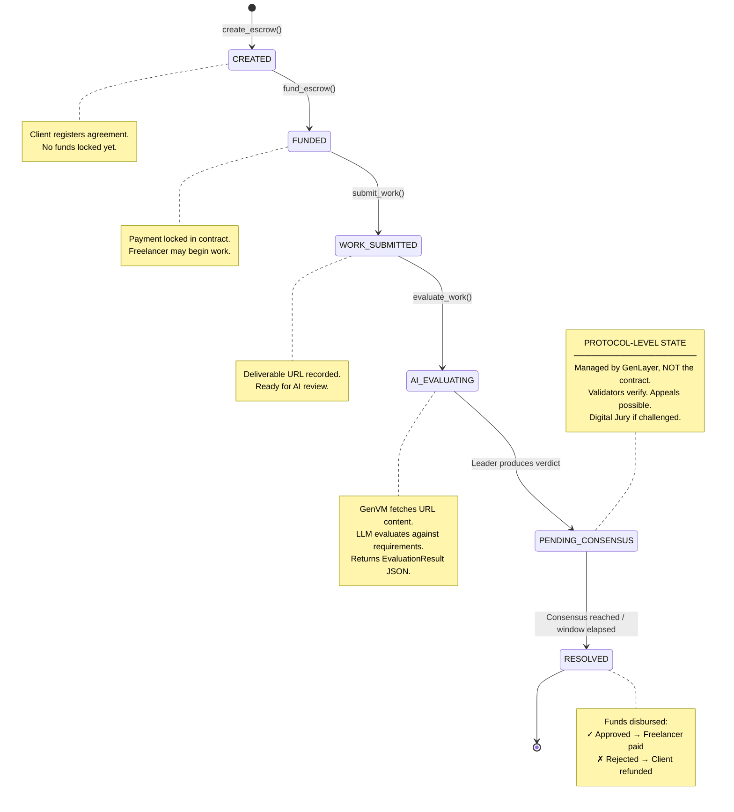
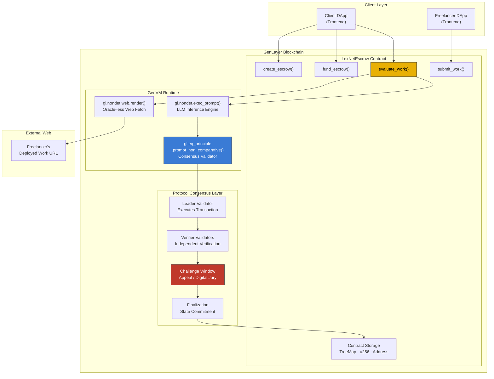

# LexNet Escrow — System Architecture Document

> **Protocol:** GenLayer (The AI-Native Trust Layer)
> **Contract Language:** Python (executed in GenVM)
> **Version:** 1.0.0
> **Last Updated:** 2026-02-28

---

## Table of Contents

1. [Executive Summary](#1-executive-summary)
2. [Escrow State Machine (Lifecycle)](#2-escrow-state-machine-lifecycle)
3. [Data Schema (Python Contract State)](#3-data-schema-python-contract-state)
4. [Mermaid Diagrams](#4-mermaid-diagrams)
5. [AI Consensus Strategy (The Equivalence Principle)](#5-ai-consensus-strategy-the-equivalence-principle)

---

## 1. Executive Summary

### What is LexNet Escrow?

LexNet Escrow is an **Autonomous AI-Driven Arbitration & Escrow Protocol** built on **GenLayer** — the first blockchain purpose-built for AI-native smart contracts. It is designed to replace the traditional human intermediary in digital service/freelance agreements with a trustless, on-chain AI arbiter.

### The Problem

In traditional freelance and digital-service marketplaces, disputes over deliverable quality are resolved by:

- **Human arbitrators** — slow, expensive, and biased.
- **Simple escrow scripts** — incapable of evaluating subjective deliverable quality (e.g., "Does this website match the design brief?").

Neither approach scales, and both create trust bottlenecks.

### The LexNet Solution

LexNet Escrow leverages GenLayer's three paradigm-breaking capabilities to build a fully autonomous escrow:

| Capability | GenLayer Primitive | LexNet Usage |
|---|---|---|
| **AI Evaluation** | `gl.nondet.exec_prompt()` | An on-chain LLM reviews the freelancer's submitted work against the client's original requirements document. |
| **Oracle-less Web Data** | `gl.nondet.web.render()` | The contract natively fetches the freelancer's deployed work (e.g., a live URL) for AI review — **no Chainlink, no API keys, no oracle middleware.** |
| **Subjective Consensus** | `gl.eq_principle.prompt_non_comparative()` | Multiple GenLayer validators independently evaluate the AI's verdict and reach decentralized consensus on whether the work passes. |
| **Dispute Resolution** | GenLayer Protocol (`FINALIZING` state) | Appeals and Digital Jury challenges are handled **natively by the protocol** during the transaction finalization window — not by custom contract logic. |

### Design Philosophy

> **"The contract evaluates. The protocol arbitrates."**

The `lexnet_escrow.py` Intelligent Contract is responsible for:
- Managing escrow lifecycle and funds.
- Structuring AI evaluation prompts for deterministic consensus.
- Emitting deterministic verdicts (`is_approved: bool`).

The GenLayer **protocol itself** is responsible for:
- Multi-validator consensus via Optimistic Democracy.
- The challenge/appeal window during the `FINALIZING` transaction state.
- Penalizing dishonest validators via slashing.

This separation of concerns is **critical** — we do NOT implement `appeal()`, `dispute()`, or jury logic inside the contract.

---

## 2. Escrow State Machine (Lifecycle)

An escrow in LexNet progresses through a strict, unidirectional state machine. Each transition is triggered by a specific on-chain transaction.

### State Definitions

| State | Description | Triggered By |
|---|---|---|
| `CREATED` | The escrow agreement has been registered on-chain with requirements text, freelancer address, and deadline. No funds deposited yet. | `create_escrow()` |
| `FUNDED` | The client has deposited the agreed payment amount into the contract. Funds are now locked. The freelancer may begin work. | `fund_escrow()` |
| `WORK_SUBMITTED` | The freelancer has submitted a URL to their deliverable (e.g., a deployed website, GitHub repo, Figma link). The escrow is now eligible for AI evaluation. | `submit_work()` |
| `AI_EVALUATING` | The contract's `evaluate_work()` function has been called. The GenVM leader validator fetches the submitted URL, structures an AI evaluation prompt, and produces a verdict. This is an **internal transitional state** — it exists only during the execution of the write transaction. | `evaluate_work()` begins |
| `PENDING_CONSENSUS` | The leader validator has produced a verdict. The GenLayer protocol is now in the `FINALIZING` phase: other validators independently verify the result. Any validator may challenge the verdict during this window. **This state is managed entirely by the protocol, not the contract.** | GenLayer `FINALIZING` phase |
| `RESOLVED` | Consensus has been reached (or the challenge window has elapsed without dispute). Funds are disbursed: to the freelancer if `is_approved == True`, or refunded to the client if `is_approved == False`. | `evaluate_work()` completes after consensus |

### Transition Rules

```
CREATED ──[fund_escrow()]──► FUNDED
FUNDED ──[submit_work()]──► WORK_SUBMITTED
WORK_SUBMITTED ──[evaluate_work()]──► AI_EVALUATING ──► PENDING_CONSENSUS ──► RESOLVED
```

### Key Constraints
- **No backward transitions.** An escrow cannot return to a previous state.
- **Single evaluation.** Once `evaluate_work()` is called, the verdict is final (subject to protocol-level appeals during `PENDING_CONSENSUS`).
- **Only the client** can call `create_escrow()` and `fund_escrow()`.
- **Only the designated freelancer** can call `submit_work()`.
- **Any party** (or an automated keeper) can call `evaluate_work()` once work is submitted.

---

## 3. Data Schema (Python Contract State)

Below is the exact schema for the `contracts/lexnet_escrow.py` Intelligent Contract, written for GenVM using GenLayer's native types.

### 3.1 Contract Storage: `LexNetEscrow`

```python
import gl
from genlayer.py.types import *

class LexNetEscrow(gl.Contract):
    # ──── Global Protocol State ────
    owner: Address                          # Protocol admin / deployer
    treasury: u256                          # Accumulated protocol fees (in wei)
    fee_basis_points: u256                  # Fee as basis points (e.g., 250 = 2.5%)
    escrow_count: u256                      # Auto-incrementing escrow ID counter

    # ──── Escrow Registry ────
    # Maps escrow_id (as string key) -> serialized Escrow JSON
    # Using TreeMap[str, str] because GenVM storage requires scalar types
    escrows: TreeMap[str, str]
```

### 3.2 Escrow Entity

Each escrow is stored as a JSON-serialized string inside the `escrows` TreeMap. The logical schema is:

```python
Escrow = {
    "id":                   u256,       # Unique escrow identifier
    "client":               Address,    # The party paying for work
    "freelancer":           Address,    # The party performing work
    "amount":               u256,       # Locked payment amount (in wei)
    "fee_amount":           u256,       # Protocol fee deducted on resolution
    "requirements_text":    str,        # Plain-text description of deliverables
    "submitted_work_url":   str,        # URL to the freelancer's deliverable
    "status":               str,        # Current lifecycle state (see §2)
    "created_at":           u256,       # Block number at creation
    "resolved_at":          u256,       # Block number at resolution (0 if unresolved)
}
```

**Why JSON strings?** GenVM's current storage model performs optimally with scalar types (`str`, `u256`, `bool`) and `TreeMap[str, str]`. Complex nested objects and custom dataclasses in storage have known runtime limitations. The JSON-serialization pattern is a **proven production workaround** validated through prior GenLayer contract development.

### 3.3 Evaluation Result Entity

The `evaluate_work()` function produces this structured result, which the AI must return as a parseable JSON string:

```python
EvaluationResult = {
    "is_approved":      bool,   # DETERMINISTIC binary verdict
    "impact_score":     int,    # 0-100 quality score
    "ai_reasoning":     str,    # Free-text explanation (NON-DETERMINISTIC, allowed to vary)
}
```

> **CRITICAL:** The `is_approved` field is the **consensus anchor**. Validators compare this boolean value to determine agreement. The `ai_reasoning` field is supplementary context — it WILL differ between validators, and that is acceptable under `prompt_non_comparative` validation.

### 3.4 Status Constants

```python
class EscrowStatus:
    CREATED         = "CREATED"
    FUNDED          = "FUNDED"
    WORK_SUBMITTED  = "WORK_SUBMITTED"
    AI_EVALUATING   = "AI_EVALUATING"
    RESOLVED        = "RESOLVED"
    # Note: PENDING_CONSENSUS is a PROTOCOL-LEVEL state (FINALIZING),
    # not stored in the contract.
```

### 3.5 Full Contract Method Interface

| Method | Decorator | Caller Restriction | Description |
|---|---|---|---|
| `__init__(fee_basis_points)` | Constructor | Deployer | Initializes protocol with fee rate. |
| `create_escrow(freelancer, requirements_text)` | `@gl.public.write` | Any (becomes client) | Registers a new escrow agreement. |
| `fund_escrow(escrow_id)` | `@gl.public.write` | Client only | Locks payment into the contract. |
| `submit_work(escrow_id, work_url)` | `@gl.public.write` | Freelancer only | Submits deliverable URL. |
| `evaluate_work(escrow_id)` | `@gl.public.write` | Any | Triggers AI evaluation + fund disbursement. |
| `get_escrow(escrow_id)` | `@gl.public.view` | Any | Returns escrow details (read-only). |
| `get_treasury()` | `@gl.public.view` | Any | Returns accumulated fees (read-only). |
| `withdraw_fees()` | `@gl.public.write` | Owner only | Withdraws accumulated protocol fees to owner. |

---

## 4. Mermaid Diagrams

### 4.1 Sequence Diagram — Full Escrow Lifecycle

```mermaid
sequenceDiagram
    autonumber
    participant C as Client
    participant SC as LexNetEscrow Contract
    participant GL as GenLayer Protocol
    participant WEB as External Web
    participant AI as GenVM LLM Engine
    participant F as Freelancer

    Note over C, F: ═══ Phase 1: Agreement ═══

    C->>SC: create_escrow(freelancer, requirements_text)
    SC-->>SC: escrow.status = CREATED
    SC-->>C: Returns escrow_id

    C->>SC: fund_escrow(escrow_id) + value
    SC-->>SC: escrow.status = FUNDED
    SC-->>C: Funds locked ✓

    Note over C, F: ═══ Phase 2: Delivery ═══

    F->>SC: submit_work(escrow_id, work_url)
    SC-->>SC: escrow.status = WORK_SUBMITTED
    SC-->>F: Submission recorded ✓

    Note over C, F: ═══ Phase 3: AI Evaluation ═══

    C->>SC: evaluate_work(escrow_id)
    SC-->>SC: escrow.status = AI_EVALUATING

    rect rgb(45, 50, 80)
        Note over SC, AI: Leader Validator Execution
        SC->>WEB: gl.nondet.web.render(work_url)
        WEB-->>SC: Raw deliverable content
        SC->>AI: gl.nondet.exec_prompt(structured_evaluation_prompt)
        AI-->>SC: EvaluationResult JSON
    end

    Note over C, F: ═══ Phase 4: Consensus ═══

    rect rgb(60, 40, 40)
        Note over GL: Protocol FINALIZING Window
        GL->>GL: Other validators independently verify
        GL->>GL: Challenge window open for appeals
        GL->>GL: Digital Jury resolves disputes (if any)
    end

    Note over C, F: ═══ Phase 5: Resolution ═══

    alt is_approved == true
        SC->>F: Transfer escrow.amount - fee
        SC-->>SC: treasury += fee_amount
    else is_approved == false
        SC->>C: Refund escrow.amount - fee
        SC-->>SC: treasury += fee_amount
    end

    SC-->>SC: escrow.status = RESOLVED
```



### 4.2 State Diagram — Escrow Lifecycle



### 4.3 Component Architecture Diagram



---

## 5. AI Consensus Strategy (The Equivalence Principle)

### 5.1 The Fundamental Challenge

GenLayer validators each run the AI evaluation **independently**. Since LLMs are inherently non-deterministic, two validators given the same prompt may produce different free-text responses:

| | Validator A | Validator B |
|---|---|---|
| **Reasoning** | "The website matches the brief. Navigation is clean and responsive." | "Deliverable aligns with requirements. Good UX and mobile support." |
| **Approved?** | `true` | `true` |

The reasoning text **differs**, but the binary verdict **agrees**. LexNet's consensus strategy is designed to exploit exactly this property.

### 5.2 Why `prompt_non_comparative`?

GenLayer offers three equivalence principle modes:

| Mode | Use Case | LexNet Applicability |
|---|---|---|
| `strict_eq` | Results must be byte-identical across all validators. | ❌ Impossible — LLM outputs are never identical. |
| `prompt_comparative` | Results are compared numerically within a tolerance range. | ⚠️ Partial — could work for `impact_score`, but not for the overall verdict. |
| `prompt_non_comparative` | An AI meta-validator determines if two outputs are **semantically equivalent**. | ✅ **Correct choice.** The meta-validator checks if both verdicts agree on `is_approved`, regardless of phrasing differences. |

### 5.3 Prompt Engineering for Consensus

The evaluation prompt is the most critical piece of the entire system. It must be structured to **maximize the probability** that all validators converge on the same `is_approved` boolean.

#### Design Principles

1. **Binary Decision Forcing.** The prompt explicitly demands a `true`/`false` verdict. No "partially approved" or "maybe" is allowed.
2. **Structured JSON Output.** The prompt mandates strict JSON format, reducing free-text variance.
3. **Criteria Anchoring.** The requirements text from the original escrow is injected verbatim, giving every validator the same evaluation rubric.
4. **Threshold-Based Scoring.** A numerical `impact_score` (0-100) is requested, and the prompt defines the approval threshold (e.g., ≥ 60 = approved). This forces determinism — if two validators score 72 and 68, both still yield `is_approved: true`.

#### The Evaluation Prompt Template

```python
evaluation_prompt = f"""
You are LexNet's AI Arbitration Engine.
You are evaluating whether a freelancer's deliverable meets the client's requirements.

═══ EVALUATION INPUTS ═══

CLIENT REQUIREMENTS:
\"\"\"
{escrow["requirements_text"]}
\"\"\"

FREELANCER'S SUBMITTED WORK (fetched content):
\"\"\"
{fetched_work_content[:4000]}
\"\"\"

═══ EVALUATION RULES ═══

1. Score the work from 0 to 100 based on how well it satisfies the requirements.
2. A score of 60 or above means APPROVED. Below 60 means REJECTED.
3. You MUST return ONLY a valid JSON object, no other text.
4. The "is_approved" field MUST be a boolean (true/false).
5. The "impact_score" field MUST be an integer from 0 to 100.
6. The "ai_reasoning" field should explain your evaluation in 2-3 sentences.

═══ REQUIRED OUTPUT FORMAT ═══

{{
    "is_approved": <true or false>,
    "impact_score": <0-100>,
    "ai_reasoning": "<your evaluation reasoning>"
}}
"""
```

### 5.4 Consensus Flow in Code

```python
@gl.public.write
def evaluate_work(self, escrow_id: str) -> str:
    # 1. Load and validate escrow state
    escrow = json.loads(self.escrows[escrow_id])
    assert escrow["status"] == EscrowStatus.WORK_SUBMITTED, "Invalid state"

    # 2. Mark as evaluating
    escrow["status"] = EscrowStatus.AI_EVALUATING

    # 3. Define the non-deterministic evaluation task
    def ai_evaluation_task() -> str:
        # 3a. Fetch the freelancer's deliverable from the web
        work_content = gl.nondet.web.render(
            escrow["submitted_work_url"],
            mode="text"
        )

        # 3b. Structure the evaluation prompt
        prompt = _build_evaluation_prompt(
            requirements=escrow["requirements_text"],
            work_content=work_content
        )

        # 3c. Execute LLM inference
        result = gl.nondet.exec_prompt(prompt)
        return result

    # 4. Execute with Equivalence Principle consensus
    #    - Leader validator runs ai_evaluation_task()
    #    - Verifier validators independently re-run it
    #    - Protocol uses AI meta-validator to check semantic equivalence
    #      (i.e., do both results agree on is_approved?)
    consensus_result = gl.eq_principle.prompt_non_comparative(
        ai_evaluation_task,
        task="Evaluate freelancer deliverable against client requirements",
        criteria="Both evaluations must agree on the is_approved boolean verdict"
    )

    # 5. Parse the consensus-validated result
    evaluation = json.loads(consensus_result)

    # 6. Disburse funds based on verdict
    if evaluation["is_approved"]:
        # Pay freelancer (minus protocol fee)
        net_amount = int(escrow["amount"]) - int(escrow["fee_amount"])
        gl.transfer(Address(escrow["freelancer"]), u256(net_amount))
    else:
        # Refund client (minus protocol fee)
        net_amount = int(escrow["amount"]) - int(escrow["fee_amount"])
        gl.transfer(Address(escrow["client"]), u256(net_amount))

    # 7. Update treasury and finalize escrow
    self.treasury += u256(int(escrow["fee_amount"]))
    escrow["status"] = EscrowStatus.RESOLVED
    escrow["resolved_at"] = gl.block.number
    self.escrows[escrow_id] = json.dumps(escrow)

    return consensus_result
```

### 5.5 Why This Prevents Consensus Failures

The architecture is specifically designed to avoid `Consensus Failed` errors through three layers of defense:

```
┌─────────────────────────────────────────────────────────┐
│  Layer 1: PROMPT DESIGN                                 │
│  • Binary decision forced (true/false only)             │
│  • Numerical threshold (≥60 → approved)                 │
│  • Strict JSON output format                            │
│  • Same requirements text injected into every validator  │
├─────────────────────────────────────────────────────────┤
│  Layer 2: EQUIVALENCE PRINCIPLE                         │
│  • prompt_non_comparative allows reasoning text to vary  │
│  • AI meta-validator focuses on is_approved agreement    │
│  • criteria string tells meta-validator exactly what     │
│    to compare: the boolean verdict                       │
├─────────────────────────────────────────────────────────┤
│  Layer 3: PROTOCOL FINALIZATION                         │
│  • Even if validators initially disagree, the challenge  │
│    window allows re-evaluation                           │
│  • Digital Jury provides final resolution                │
│  • Economic incentives (slashing) deter dishonest votes  │
└─────────────────────────────────────────────────────────┘
```

### 5.6 Edge Cases and Mitigations

| Edge Case | Risk | Mitigation |
|---|---|---|
| **URL is unreachable** | `gl.nondet.web.render()` fails | Contract catches the exception and returns `is_approved: false` with reasoning "Unable to access deliverable." All validators hit the same failure → deterministic consensus. |
| **Borderline quality (score ≈ 60)** | Validators may split 58 vs. 62, causing `is_approved` disagreement | The threshold (60) is deliberately set at a reasonable midpoint. The prompt instructs the AI to be decisive. In practice, quality tends to cluster far from the boundary. Protocol's challenge mechanism provides a safety net. |
| **LLM returns malformed JSON** | `json.loads()` throws exception | Wrap in try/except. On parse failure, treat as `is_approved: false`. Consistent failure path ensures consensus. |
| **Extremely long deliverable content** | Token limit overflow | Content is truncated to 4000 characters before injection into the prompt. All validators truncate identically, ensuring identical input. |
| **Empty/spam submission** | Fraudulent freelancer submits junk | The AI evaluation will score it near 0. `is_approved: false` is guaranteed across all validators. Client is refunded. |

---

## Appendix A: GenLayer Protocol Acknowledgments

This architecture has been designed with strict adherence to GenLayer's protocol paradigms:

| Paradigm | Status | Implementation |
|---|---|---|
| Intelligent Contracts in Python / GenVM | ✅ | `contracts/lexnet_escrow.py` uses `gl.Contract` base class |
| Oracle-less web data via `gl.nondet.web.render()` | ✅ | Freelancer deliverables fetched natively inside `evaluate_work()` |
| Subjective consensus via `gl.eq_principle.prompt_non_comparative()` | ✅ | AI evaluation results validated through non-comparative equivalence |
| Appeals/disputes handled by GenLayer protocol (NOT contract code) | ✅ | No `appeal()`, `dispute()`, or jury arrays exist in the contract |
| GenVM-compatible storage (scalar types, `TreeMap`) | ✅ | Escrows stored as `TreeMap[str, str]` with JSON serialization |

## Appendix B: File Structure

```
LexNet/
├── ARCHITECTURE.md                  # This document
├── contracts/
│   └── lexnet_escrow.py             # The Intelligent Contract
├── tests/
│   ├── test_escrow_lifecycle.py     # State machine transition tests
│   └── test_evaluation_prompt.py    # Prompt output parsing tests
└── scripts/
    └── deploy.py                    # Deployment script (localnet/testnet)
```

---

*This document is the single source of truth for the LexNet Escrow system design. All implementation work on `contracts/lexnet_escrow.py` must conform to the schemas, state machine, and consensus strategy defined herein.*
