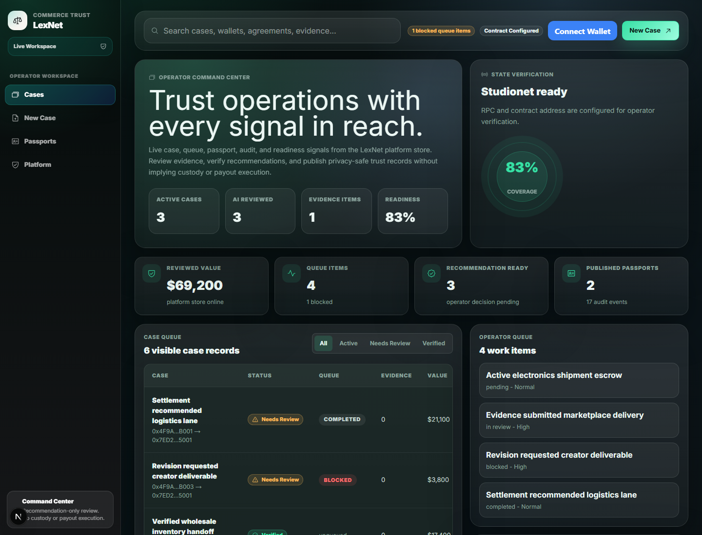
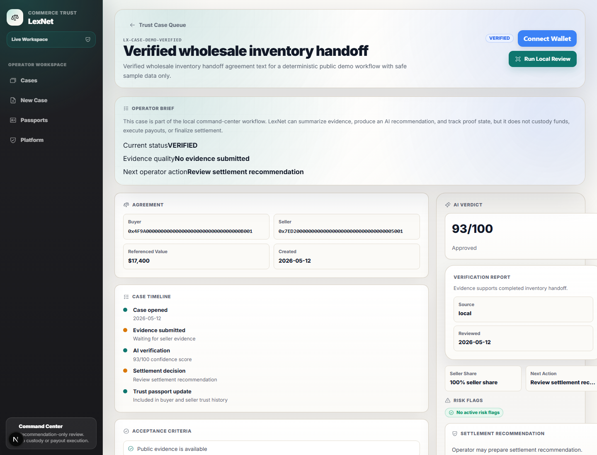
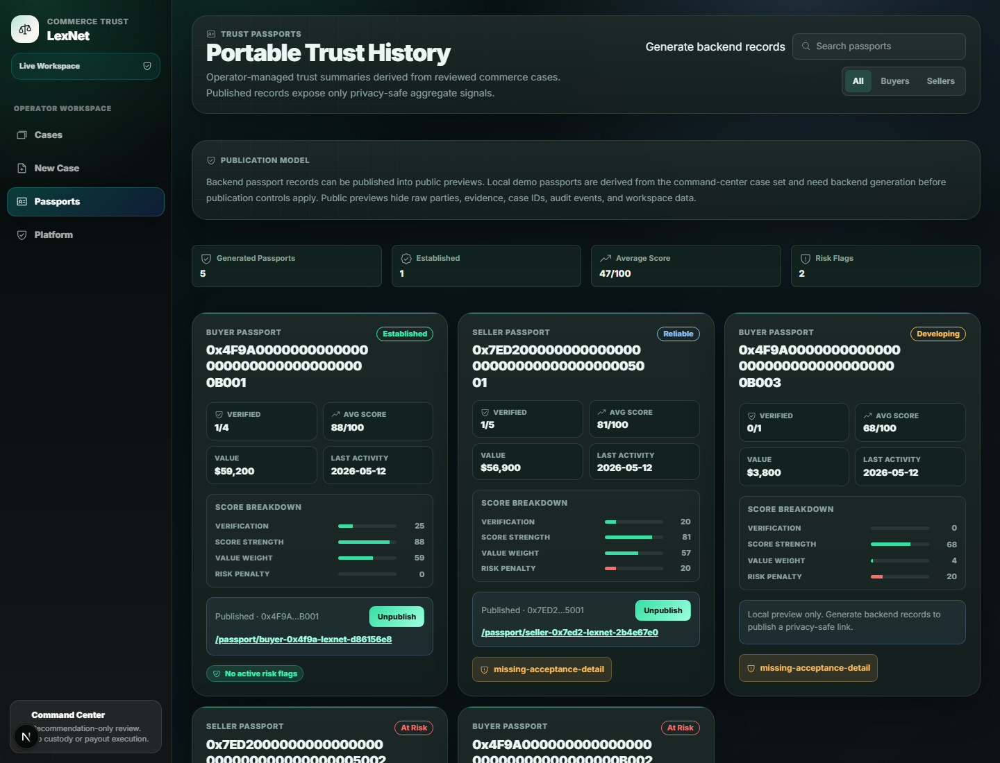
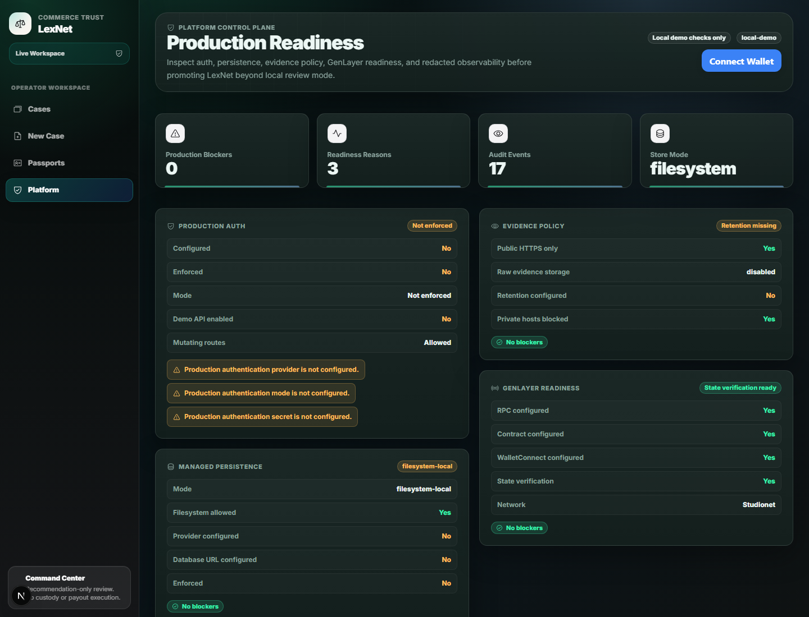
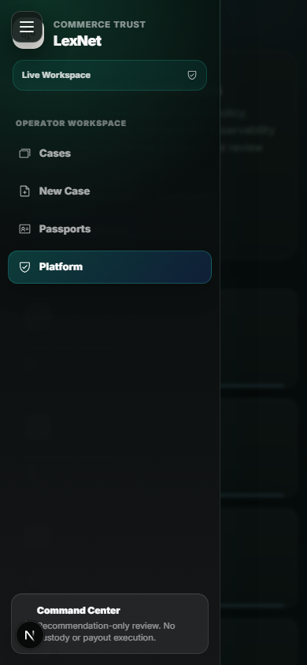

# LexNet

LexNet is an AI-assisted commerce trust platform for case intake, delivery
evidence, verification recommendations, operator review, GenLayer proof
boundaries, and privacy-safe trust passports.

The current MVP is recommendation-only. It does not custody funds, execute
payouts, move real value, or claim settlement finality from local review or
GenLayer submission alone.

## Public Demo

- Production URL: [https://lexnet-seven.vercel.app](https://lexnet-seven.vercel.app)
- Platform readiness: [https://lexnet-seven.vercel.app/platform](https://lexnet-seven.vercel.app/platform)
- Vercel preview deployments can require Vercel authentication. Use the
  production URL above for public sharing.

## UI Preview

### Command Center



The command center is the operator workspace for active cases, queue state,
readiness signals, review priorities, and recent platform activity.

### Case Review



Case detail pages keep evidence, local recommendation state, GenLayer proof
actions, and settlement recommendation language in one review surface.

### Trust Passports



Trust passports aggregate reviewed commerce history into privacy-safe records
that can be published or unpublished by operators.

### Platform Readiness



The platform view reports auth, persistence, evidence policy, GenLayer
readiness, and redacted observability without exposing secrets or raw evidence.

### Mobile Navigation



Mobile navigation uses a drawer with the sidebar status card pinned to the
bottom of the viewport.

## Product Loop

1. Create a commerce case.
2. Submit public delivery evidence.
3. Run local AI-style verification and produce a recommendation.
4. Optionally submit or read guarded GenLayer proof state.
5. Publish or update a privacy-safe trust passport.

## Main Routes

- `/` - command-center dashboard.
- `/cases/new` - create a commerce case.
- `/cases/[id]` - review evidence, run verification, and inspect GenLayer proof state.
- `/passports` - manage backend trust passport records.
- `/passport/[slug]` - public privacy-safe passport page.
- `/platform` - redacted readiness and observability view.
- `/login` - demo operator login page for gated demo deployments.

## Architecture

- `contracts/lexnet_commerce_core.py` models the GenLayer commerce verification
  boundary.
- `frontend/src/app/` contains the Next.js App Router pages and API routes.
- `frontend/src/components/` contains the dashboard, sidebar, case review,
  readiness, wallet, and passport UI.
- `frontend/src/lib/lexnet-*.ts` contains pure commerce, evidence,
  verification, and passport domain logic.
- `frontend/src/lib/platform/` contains platform persistence, auth, readiness,
  observability, passport DTOs, and demo seed helpers.
- `.lexnet-data/store.json` is ignored local runtime/demo state.

## Local Setup

From the repository root:

```bash
cd frontend
npm install
npm run dev
```

The default dev server runs on `http://localhost:3002`.

For the seeded demo workflow:

```bash
npm --prefix frontend run demo:seed
npm --prefix frontend run demo:dev
```

`demo:dev` prefers port `3002` and falls back to `3003` if another checkout is
already using `3002`.

## Demo Data

Seed deterministic local platform data:

```bash
npm --prefix frontend run demo:seed
```

Reset local platform data:

```bash
npm --prefix frontend run demo:reset
```

Back up local platform data before reset:

```bash
npm --prefix frontend run demo:backup
```

Demo data includes workspaces, operators, queue items, commerce cases, public
evidence references, local verification reports, audit events, and published
trust passports. Do not commit `.lexnet-data/`.

## Verification

From the repository root:

```bash
npm --prefix frontend run test:domain
npm --prefix frontend run test:platform
npm --prefix frontend run build
```

Combined MVP check:

```bash
npm --prefix frontend run verify:mvp
```

Pilot readiness check:

```bash
npm --prefix frontend run pilot:prepare
npm --prefix frontend run pilot:check
```

`pilot:prepare` reseeds deterministic local demo data and refuses to run in
`LEXNET_RUNTIME_MODE=production`. `pilot:check` reports auth, persistence,
evidence policy, GenLayer readiness, store counts, GenLayer execution counts,
and forbidden secret-like keys.

## Environment

Copy `frontend/.env.example` to `frontend/.env.local` for local development.
Keep `.env.local`, private keys, demo secrets, and `.lexnet-data/` out of git.

Public frontend configuration:

```bash
NEXT_PUBLIC_LEXNET_CONTRACT_ADDRESS=
NEXT_PUBLIC_GENLAYER_RPC_URL=https://studio.genlayer.com/api
NEXT_PUBLIC_GENLAYER_NETWORK_LABEL=Studionet
NEXT_PUBLIC_WALLETCONNECT_PROJECT_ID=
NEXT_PUBLIC_LEXNET_OWNER_WALLET_ADDRESS=
```

Demo-private and production boundary configuration:

```bash
LEXNET_ENABLE_DEMO_PRIVATE_API=true
LEXNET_DEMO_PRIVATE_API_TOKEN=
LEXNET_PRODUCTION_AUTH_MODE=off
LEXNET_PRODUCTION_AUTH_SECRET=
LEXNET_PRODUCTION_AUTH_CLOCK_SKEW_SECONDS=60
LEXNET_MANAGED_DATABASE_URL=
LEXNET_MANAGED_PERSISTENCE_PROVIDER=
LEXNET_EVIDENCE_RETENTION_POLICY=
```

Demo-private API requests require:

```http
x-lexnet-operator-id: operator-demo
```

If `LEXNET_DEMO_PRIVATE_API_TOKEN` is set, include:

```http
Authorization: Bearer <token>
```

## GenLayer Boundary

LexNet uses `genlayer-js` through `frontend/src/lib/genlayer-client.ts`.

The platform readiness page checks whether the public GenLayer RPC URL,
contract address, and WalletConnect project id are configured. The current
production deployment reports Studionet readiness through
`/api/platform/status`.

Important proof rules:

- A GenLayer transaction hash is submission evidence only.
- LexNet marks a case as contract-state verified only after reading
  `get_case(case_id)` and finding a `verification_report` in contract state.
- Local verification remains the fallback review path.
- The UI must not claim fund movement, payout execution, settlement completion,
  or dispute finality from a local report alone.

## Public Passport Safety

Published passport pages expose redacted subject data and aggregate trust
metrics only. They do not expose raw parties, evidence URLs, case IDs, audit
events, operator records, workspace membership data, or unpublished passports.

## Deployment

The Vercel project is linked from `frontend/.vercel/project.json` and has
`frontend` configured as the project root.

Deploy a preview:

```bash
cd frontend
vercel deploy .. -y
```

Deploy production:

```bash
cd frontend
vercel deploy .. --prod -y
```

The current public production alias is:

```text
https://lexnet-seven.vercel.app
```

## Production Boundary

Current hardening status:

- Demo-private APIs can require both `x-lexnet-operator-id: operator-demo` and
  an optional bearer token.
- Production mode requires enforced production auth, such as a trusted-header
  HMAC boundary. Provider/env naming alone is not enough.
- Filesystem persistence is local demo infrastructure, not a managed production
  database.
- Backup/restore commands are local operational tools, not managed disaster
  recovery.
- Guarded GenLayer SDK calls require readiness checks and must be followed by
  contract-state read-back before proof claims are shown.

Before production use, LexNet still needs a managed DB adapter, deployment
observability, managed backups, audited GenLayer transaction execution and
state verification, and security review. Payment custody or settlement transfer
paths remain out of scope until explicitly designed and audited.

## License

See repository and subfolders for license information.
